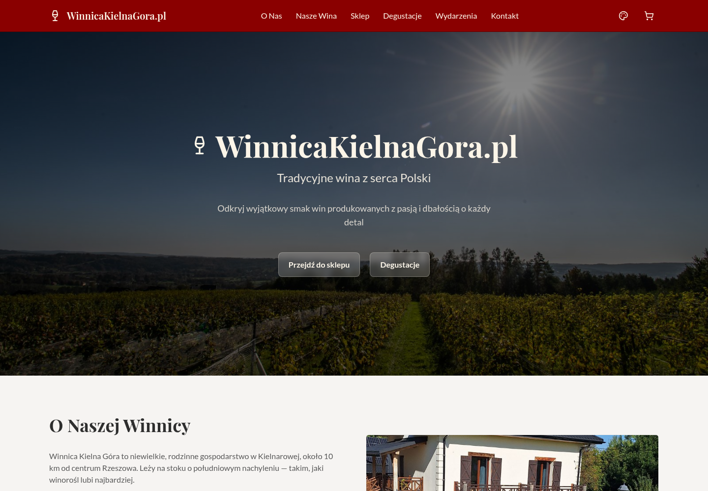
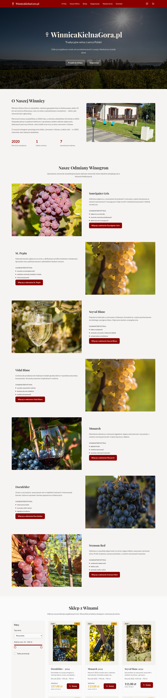
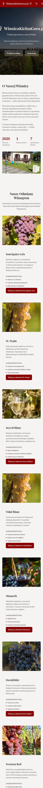
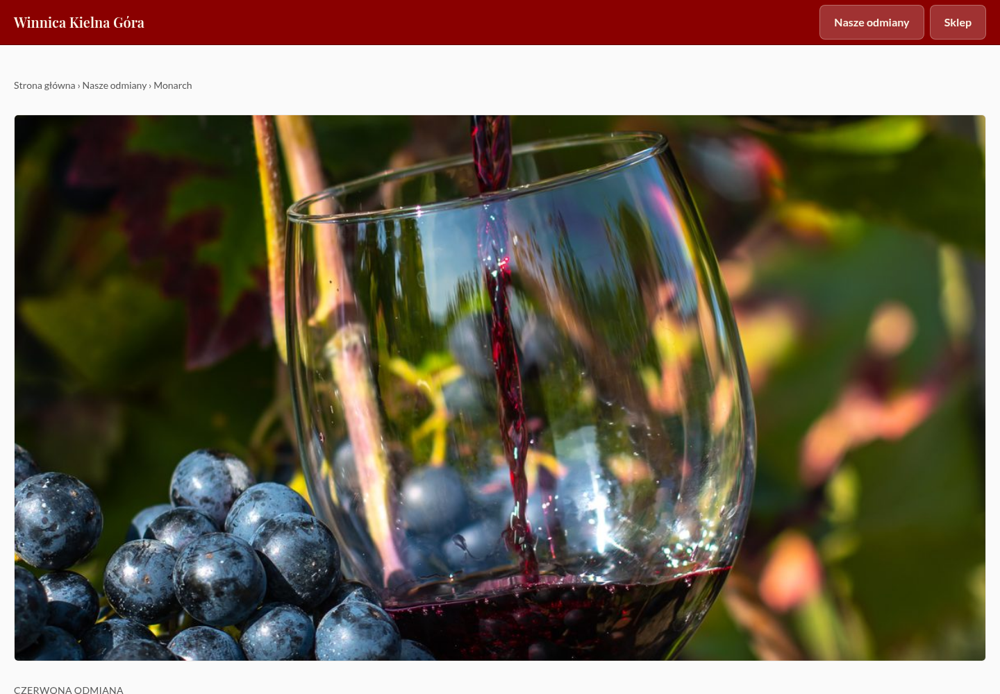

# Audyt strony Winnicy Kielna Góra — 2026-09-02

> **Zrzuty ekranu nie są w repozytorium.** Pliki `.png` z tego katalogu są dowodem roboczym
> i zostały wyłączone z gita (`audit/**/*.png` w `.gitignore`), żeby nie obciążać repozytorium
> dziesięcioma megabajtami obrazów. Odwołania do obrazków poniżej działają tylko w lokalnej
> kopii katalogu — na GitHubie pozostaną puste.

## Zakres

Połączony audyt UX, responsywności, dostępności i technicznego SEO strony głównej oraz
reprezentatywnej strony odmiany (`wina/monarch.html`). Zrzuty wykonano w bieżącej wersji
projektu na viewportach 1440 × 1000 px i 390 × 844 px. Pełne zrzuty strony głównej mają
wysokość odpowiednio 6000 px i 7000 px.

## Cel użytkownika i cel dostępności

Odwiedzający powinien w kilka sekund zrozumieć, gdzie znajduje się winnica, poznać odmiany,
sprawdzić ofertę oraz łatwo przejść do degustacji lub kontaktu. Interfejs powinien zachować
czytelność bez przewijania poziomego, mieć semantyczne linki i jednoznacznie opisane kontrolki.

## Kroki i dowody

### 1. Pierwszy ekran — desktop — stan dobry z drobnymi tarciami

- Mocne strony: autentyczne zdjęcie od razu osadza markę w miejscu; kontrast i główne CTA są
  czytelne; najważniejsze sekcje są widoczne w nawigacji.
- Ryzyka UX: `Degustacje` i `Wydarzenia` prowadzą w praktyce do tej samej części strony, co
  niepotrzebnie zagęszcza nagłówek. Nazwa `WinnicaKielnaGora.pl` jest trudniejsza do przeskanowania
  niż naturalna nazwa marki i nie zgadza się z tytułem strony.
- Ryzyko SEO: nawigacja sekcyjna jest zbudowana z przycisków obsługiwanych przez JavaScript,
  a nie z linków z `href`, więc nie tworzy normalnej, indeksowalnej siatki linków.

### 2. Pierwszy ekran — telefon — stan krytyczny

- Potwierdzony błąd: nagłówek H1 i ikona wychodzą poza viewport po obu stronach. Użytkownik nie
  widzi pełnej nazwy marki, a strona sprawia wrażenie uciętej.
- Nagłówek mieści wszystkie ikony tylko na styk. Brakuje tekstowych nazw dostępności przy
  przyciskach stylu, koszyka i menu oraz stanu `aria-expanded` dla rozwijanych elementów.
- CTA są wystarczająco duże, ale prowadzą przez skrypt; powinny być prawdziwymi linkami do
  istniejących kotwic.

### 3. Pełna ścieżka strony głównej — desktop i telefon — wymaga korekty hierarchii

- Mocne strony: układ kart odmian jest konsekwentny, zdjęcia są dobrej jakości, a przejścia do
  osobnych stron odmian dają wyszukiwarkom wartościowe, tematyczne landingi.
- Główne tarcie: siedem rozbudowanych kart zajmuje zdecydowaną większość strony. Na telefonie
  użytkownik musi przejść przez wielokrotność wysokości ekranu, zanim dotrze do sklepu,
  degustacji i kontaktu. Na stronie głównej wystarczy krótsze streszczenie; rozwinięcie już
  istnieje na podstronach odmian.
- Sekcje mają stałe, duże pionowe odstępy (`py-20`) także na małych ekranach, co dodatkowo
  wydłuża ścieżkę mobilną.
- Brakuje linku „Przejdź do treści”, widocznego fokusu zaprojektowanego spójnie z motywami oraz
  respektowania `prefers-reduced-motion` dla płynnego przewijania.

### 4. Strona odmiany — desktop — stan dobry

- Mocne strony: poprawna hierarchia H1/H2, breadcrumb w interfejsie i JSON-LD, osobny canonical,
  dobry obraz otwierający oraz czytelny rytm treści.
- Obraz hero zajmuje niemal cały pierwszy viewport, więc właściwa treść i H1 pojawiają się dopiero
  pod zgięciem. To jest atrakcyjne wizualnie, ale słabsze dla szybkiego skanowania strony z wyniku
  wyszukiwania.

### 5. Strona odmiany — telefon — stan dostateczny

- Treść i obraz mieszczą się w viewportcie, ale oba przyciski w nagłówku mają różną wysokość;
  `Nasze odmiany` łamie się na dwa wiersze. Nagłówek wygląda przypadkowo i zabiera dużo miejsca.
- Tekst główny ma dobrą wielkość i długość wiersza. H2 przy dolnej krawędzi dowodu pokazuje, że
  tytuły pozostają czytelne bez poziomego overflow.

## Najważniejsze ryzyka SEO w kodzie

1. H1 strony głównej (`WinnicaKielnaGora.pl`) nie odpowiada naturalnej nazwie użytej w `<title>`
   i `og:title`, co osłabia spójność sygnałów tytułowych.
2. Linki sekcyjne są przyciskami z `data-scroll`, a nie elementami `<a href="…">`.
3. Strona główna nie ma danych strukturalnych `WebSite`; pełne `Organization` należy odłożyć do
   czasu podania prawdziwego adresu, telefonu, e-maila i logo.
4. Brakuje metadanych obrazu społecznościowego (`og:image:alt`, szerokość, wysokość) i kart
   Twitter/X. To nie blokuje indeksacji, ale pogarsza jakość udostępnień.
5. Treść danych sklepu zawiera niespójności wymagające decyzji właściciela (np. Monarch i
   Dornfelder jako kategoria `Białe`, rozjazd `Svenson`/`Swenson`). Nie należy ich automatycznie
   „poprawiać” w ramach layoutu, ale publikacja takich danych obniża wiarygodność treści.

## Rekomendowany zakres poprawy

1. Naprawić hero i nagłówek mobilny bez zmiany palety, typografii ani charakteru marki.
2. Zamienić nawigację i CTA sekcyjne na semantyczne linki, scalić pozycje degustacji/wydarzeń
   oraz dodać nazwy dostępności i stany elementów rozwijanych.
3. Skrócić listę odmian na stronie głównej do responsywnej siatki kart-streszczeń, zachowując
   pełne opisy na istniejących podstronach i wszystkie linki wewnętrzne.
4. Zmniejszyć odstępy sekcji na telefonie i dopracować nagłówki podstron odmian.
5. Ujednolicić H1, `<title>` i Open Graph; dodać bezpieczne `WebSite` JSON-LD i metadane
   udostępnień bez wymyślania brakujących danych firmy.

## Granice dowodów

Zrzuty potwierdzają problemy z reflow, hierarchią i widocznym układem. Nie dowodzą pełnej
zgodności z WCAG, zachowania czytników ekranu ani kompletnej obsługi klawiatury. W statycznym
trybie zrzutów nie uchwycono otwartego menu mobilnego, panelu koszyka ani stanów focus/hover.
Nie klikano wysyłki formularza ani płatności, ponieważ oba elementy uruchamiają blokujące alerty.
